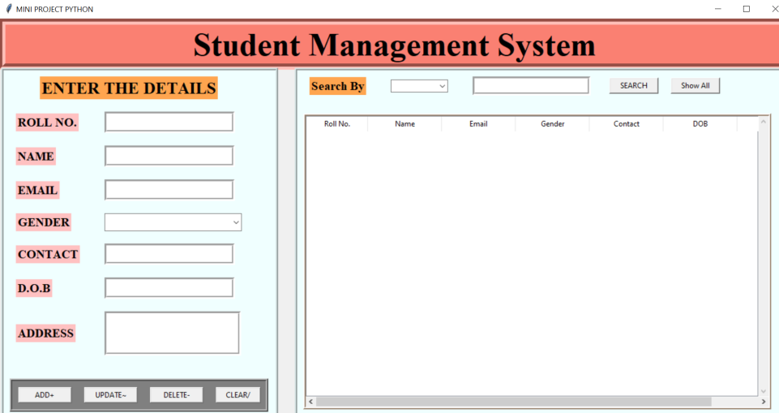

# Student Management System in Python 👩‍🏫

## Introduction

 This software, "Student Detail Management System," gives us a simple interface for maintaining student information at educational institutes or a customer's contact information if utilised for commercial reasons. Manually accomplishing this might be laborious and time consuming. Thus, the many capabilities included in this project will allow us to conveniently maintain a student's background details and personal information. 

### Built With

* [Python](https://www.python.org/)
* [MySQL](https://dev.mysql.com/doc/)
* [Tkinter](https://docs.python.org/3/library/tk.html)
* [phpmyadmin](https://www.phpmyadmin.net/docs/)
* [XAMPP](https://www.apachefriends.org/docs/)

### Features
1. Add a student to the database
2. Delete a student from the database
3. Update the details of an existing student
4. Clear the console
5. Search by:  
        - Name  
        - Contact Number  
        - Roll number

### Dashboard Screenshot

 

